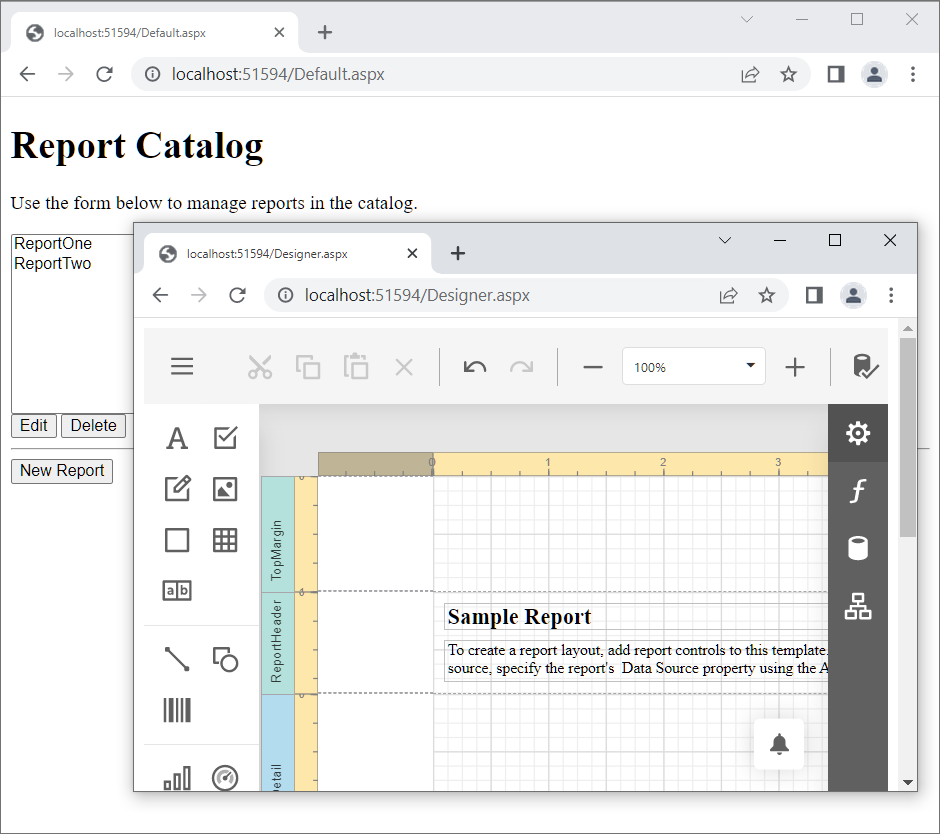

<!-- default badges list -->

[](https://supportcenter.devexpress.com/ticket/details/T178798)
[](https://docs.devexpress.com/GeneralInformation/403183)
[](#does-this-example-address-your-development-requirementsobjectives)
<!-- default badges end -->
# Reporting for Web Forms - Report Designer with Report Storage and Custom Command

This example integrates the [End-User Report Designer](https://docs.devexpress.com/XtraReports/17103/web-reporting/asp-net-webforms-reporting/end-user-report-designer) into an ASP.NET WebForms application and implements a **Microsoft SQL Server database [report storage](https://docs.devexpress.com/XtraReports/DevExpress.XtraReports.Web.Extensions.ReportStorageWebExtension)** to **add**, **edit** and **delete** reports. This example also demonstrates how to add [custom commands to the report designer menu](https://docs.devexpress.com/XtraReports/17626/web-reporting/asp-net-webforms-reporting/end-user-report-designer/customization/customize-the-report-designer-toolbar) at runtime. A custom **Close** menu command redirects the user to the homepage.



### Before you start

#### Create Reports Database

Create a **Reports** database in the local Microsoft SQL Server. Add the **ReportLayout** table with the following script:
#### SQL
```SQL
USE [Reports]
GO
SET ANSI_NULLS ON
GO
SET QUOTED_IDENTIFIER ON
GO
CREATE TABLE [dbo].[ReportLayout](
     [ReportId] [int] IDENTITY(1,1) NOT NULL,
     [DisplayName] [nvarchar] NULL,
     [LayoutData] [varbinary] NULL,
     [ReportId] ASC
CONSTRAINT [PK_ReportLayout6] PRIMARY KEY CLUSTERED 
(
)WITH (PAD_INDEX = OFF, STATISTICS_NORECOMPUTE = OFF, IGNORE_DUP_KEY =  OFF, ALLOW_ROW_LOCKS = ON, ALLOW_PAGE_LOCKS = ON) ON [PRIMARY]
) ON [PRIMARY] TEXTIMAGE_ON [PRIMARY]
GO
```
#### SQL Server 2016 - v13.0.x.x
```SQL
USE [Reports]
GO
SET ANSI_NULLS ON
GO
SET QUOTED_IDENTIFIER ON
GO
CREATE TABLE [dbo].[ReportLayout](
        [ReportId] [int] IDENTITY(1,1) NOT NULL ,
        [DisplayName] [nvarchar](50) NULL,
        [LayoutData] [varbinary](max) NULL,
        CONSTRAINT PK_ReportLayout PRIMARY KEY (ReportId)
);
SELECT * 
FROM [dbo].[ReportLayout]
ORDER BY [ReportId] ASC        
GO
```
#### Create Northwind Database

Create the [Northwind database](https://github.com/microsoft/sql-server-samples/tree/master/samples/databases/northwind-pubs) and add it to your local Microsoft SQL server. 

## Files to Review

* [CustomReportStorageWebExtension.cs](./CS/SimpleWebReportCatalog/App_Code/CustomReportStorageWebExtension.cs) (VB: [CustomReportStorageWebExtension.vb](./VB/SimpleWebReportCatalog/App_Code/CustomReportStorageWebExtension.vb))
* [Default.aspx](./CS/SimpleWebReportCatalog/Default.aspx) (VB: [Default.aspx](./VB/SimpleWebReportCatalog/Default.aspx))
* [Default.aspx.cs](./CS/SimpleWebReportCatalog/Default.aspx.cs) (VB: [Default.aspx.vb](./VB/SimpleWebReportCatalog/Default.aspx.vb))
* [Designer.aspx](./CS/SimpleWebReportCatalog/Designer.aspx) (VB: [Designer.aspx](./VB/SimpleWebReportCatalog/Designer.aspx))
* [Designer.aspx.cs](./CS/SimpleWebReportCatalog/Designer.aspx.cs) (VB: [Designer.aspx.vb](./VB/SimpleWebReportCatalog/Designer.aspx.vb))
* [DesignerTask.cs](./CS/SimpleWebReportCatalog/DesignerTask.cs) (VB: [DesignerTask.vb](./VB/SimpleWebReportCatalog/DesignerTask.vb))
* [Global.asax.cs](./CS/SimpleWebReportCatalog/Global.asax.cs) (VB: [Global.asax.vb](./VB/SimpleWebReportCatalog/Global.asax.vb))

## Documentation

- [Create an ASP.NET Web Forms Application with a Report Designer](https://docs.devexpress.com/XtraReports/119172/web-reporting/asp-net-webforms-reporting/end-user-report-designer-in-asp-net-web-forms-reporting/quick-start/create-an-aspnet-webforms-application-with-a-report-designer)
- [Add a Report Storage (ASP.NET Web Forms)](https://docs.devexpress.com/XtraReports/17553/web-reporting/asp-net-webforms-reporting/end-user-report-designer-in-asp-net-web-forms-reporting/add-a-report-storage)
- [End-User Report Designer Customization (ASP.NET Web Forms)](https://docs.devexpress.com/XtraReports/17546/web-reporting/asp-net-webforms-reporting/end-user-report-designer-in-asp-net-web-forms-reporting/customization)


## More Examples

* [How to Integrate Web Report Designer in an MVC Web Application](https://github.com/DevExpress-Examples/Reporting_how-to-integrate-the-web-report-designer-into-an-mvc-web-application-t190370)
* [Reporting for Web Forms - Report Designer with the ASPxFileManager Control in the Open Report Dialog](https://github.com/DevExpress-Examples/reporting-web-forms-designer-file-management-dialog)
<!-- feedback -->
## Does this example address your development requirements/objectives?

[](https://www.devexpress.com/support/examples/survey.xml?utm_source=github&utm_campaign=reporting-web-forms-designer-storage&~~~was_helpful=yes) [](https://www.devexpress.com/support/examples/survey.xml?utm_source=github&utm_campaign=reporting-web-forms-designer-storage&~~~was_helpful=no)

(you will be redirected to DevExpress.com to submit your response)
<!-- feedback end -->
